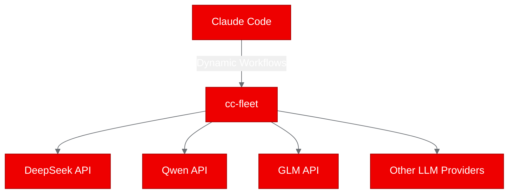
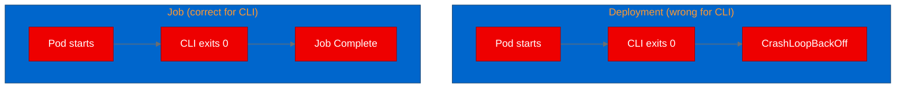

# Image Review -- v1

## Scores

| Dimension | Weight | Score (1-10) | Weighted |
|---|---|---|---|
| Placement rationale | 2x | 3 | 6 |
| Prompt specificity | 2x | 1 | 2 |
| Brand compliance | 2x | 7 | 14 |
| Aspect ratio & sizing | 1x | 1 | 1 |
| Alt text quality | 1x | 1 | 1 |
| Image count | 1x | 3 | 3 |
| **Total** | | | **27 / 90** |

**Normalized score: 3.0 / 10**

---

## Visual Inventory

The draft contains **one** Mermaid diagram and **zero** image placeholders. For a 145-line technical post covering containerization, OpenShift builds, Job-based deployment, and test results, this is significantly under-illustrated.

### Mermaid Diagram (lines 74-80): Build Pipeline Flow

- **Diagram clarity: 6/10.** The `graph LR` correctly shows the linear flow from source to registry, but it is overly simple. It collapses two stages (multi-stage Dockerfile build and push) into three generic nodes. It does not show the two-stage build distinction (go-toolset builder vs. ubi-minimal runtime) that the text emphasizes heavily.
- **Diagram type: Correct.** A left-to-right flowchart is appropriate for a linear pipeline.
- **`%%{init}%%` theme block: Present and correct.** Uses `primaryColor: '#EE0000'`, `primaryBorderColor: '#A30000'`, `lineColor: '#6A6E73'`, `secondaryColor: '#F0F0F0'`, `tertiaryColor: '#0066CC'`. This is compliant with Red Hat brand palette.

**Recommendation:** Expand the diagram to show the two Dockerfile stages explicitly:

---

## Missing Image Opportunities

The draft has several sections that would benefit significantly from visual aids. Below are specific recommendations:

### 1. Hero Image (before or after the title)

Every Red Hat Developer Blog post should have a hero image. This draft has none.

**Suggested prompt:** "A flat-style technical illustration showing a Go gopher mascot standing on a container ship labeled 'UBI', sailing toward a red OpenShift logo on the horizon. Color palette: Red Hat red #EE0000, dark background #151515, white #FFFFFF accents, teal #147878 for the ocean. Minimal, clean, developer-blog style. Aspect ratio 16:9, 1200x675px."

**Alt text:** "Illustration of a Go gopher on a UBI container ship heading toward the OpenShift platform, representing containerization of a Go CLI tool."

### 2. Architecture / Component Diagram (in "What is cc-fleet?" section)

The text describes cc-fleet's role bridging third-party LLM providers into Claude Code's multi-agent workflows. A diagram would make this immediately clear.

**Suggested prompt (Mermaid preferred):**

**Alt text:** "Diagram showing cc-fleet as a bridge between Claude Code and multiple third-party LLM providers including DeepSeek, Qwen, and GLM."

### 3. Job-based Deployment Pattern Diagram (in "Job-based deployment for CLI validation" section)

The distinction between Deployment (CrashLoopBackOff) and Job (run-to-completion) is a key insight. A visual comparison would reinforce it.

**Suggested prompt (Mermaid preferred):**

**Alt text:** "Comparison diagram showing why Kubernetes Jobs are correct for CLI tool validation: a Deployment restarts after CLI exit causing CrashLoopBackOff, while a Job completes successfully."

### 4. Test Results Visual (in "Test results" section)

The table is adequate, but a small pass/fail visual summary (e.g., a Mermaid pie chart or a styled callout) would draw the eye. This is lower priority since the table is clear.

---

## Per-Dimension Feedback

### Placement rationale (3/10)
The single Mermaid diagram is placed appropriately after the build commands, but the post has large stretches of text-only content with no visual breaks. The "What is cc-fleet?" section, the Job vs. Deployment distinction, and the test results section all lack visuals that would aid comprehension.

### Prompt specificity (1/10)
No image placeholders exist in the draft, so there are no generation prompts to evaluate. Score reflects the complete absence rather than poor quality.

### Brand compliance (7/10)
The one Mermaid diagram correctly uses Red Hat brand hex codes in the `%%{init}%%` block. Score is limited because there are no other visuals to evaluate, and no hero image exists to verify brand alignment.

### Aspect ratio & sizing (1/10)
No aspect ratios specified anywhere. No hero image dimensions. The Mermaid diagram inherits browser-default sizing, which is acceptable for Mermaid but no explicit ratios are provided for any image placeholders (because none exist).

### Alt text quality (1/10)
No alt text exists anywhere in the draft. The Mermaid diagram has no accompanying alt text or caption.

### Image count (3/10)
One Mermaid diagram for a 145-line post is too few. The post covers 7 distinct sections and would benefit from 3-5 visuals total (hero + 2-3 inline diagrams). Zero image placeholders means the author did not plan for any generated images.

---

## Summary

The draft is text-heavy with a single simple Mermaid diagram as its only visual element. The diagram uses correct Red Hat brand theming, which is good. However, the post needs:

1. **A hero image** -- mandatory for Red Hat Developer Blog format
2. **An architecture diagram** in "What is cc-fleet?" showing the LLM provider bridging concept
3. **An expanded build pipeline diagram** replacing the current oversimplified Mermaid
4. **A Job vs. Deployment comparison diagram** to reinforce the key deployment insight
5. **Alt text** on all visual elements

Adding these 3-4 visuals would transform the post from a wall of text with code blocks into an engaging, scannable developer blog post. All suggested additions are diagrammable content suitable for Mermaid rendering with Red Hat brand theming.
