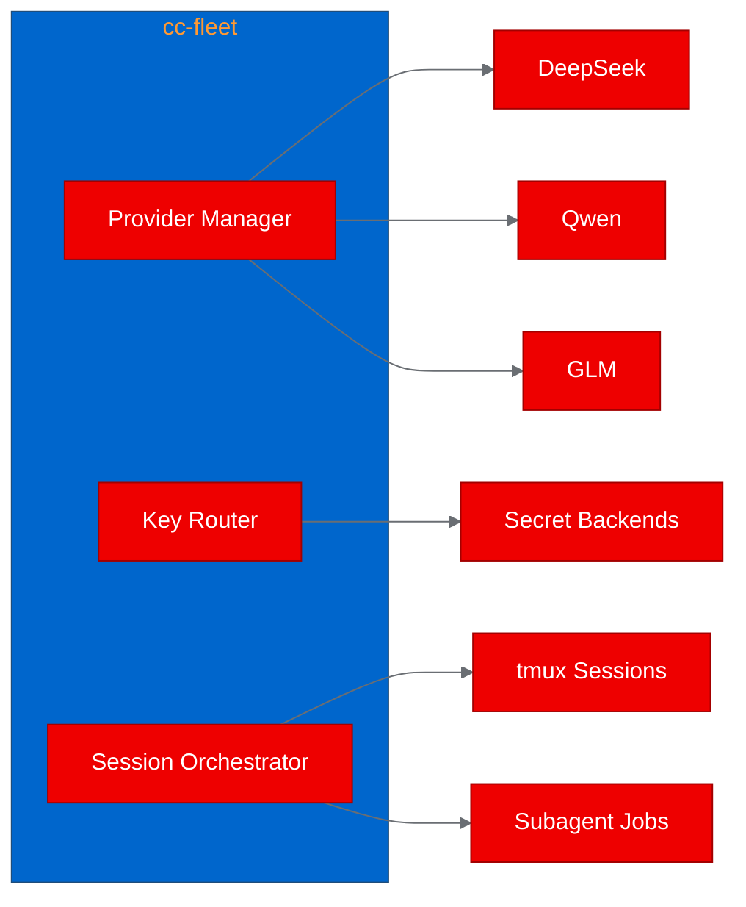
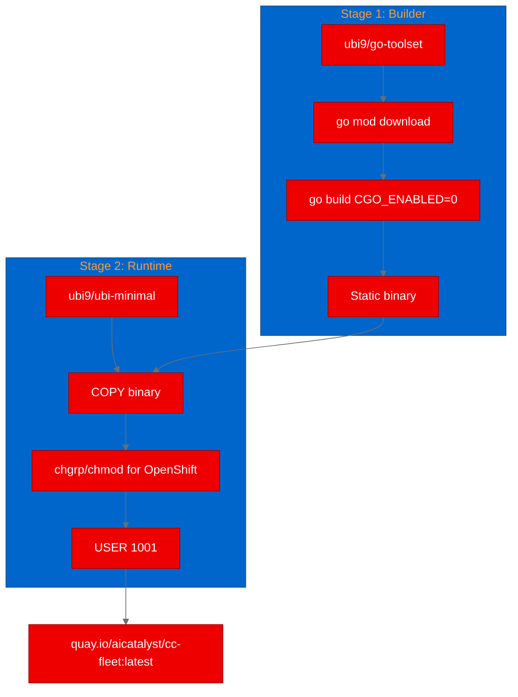
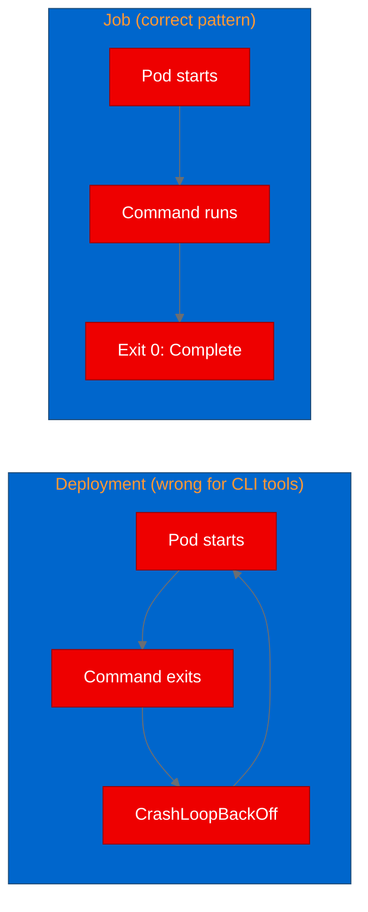

--------------------
**[Image Placeholder 1: Hero image for cc-fleet PoC blog post]**

**Placement rationale**: Sets the visual tone at the top, establishes the containerization theme before the reader hits the first paragraph.
**Image generation prompt**: A clean, modern technical illustration showing a Go gopher mascot stepping from a laptop screen into a Kubernetes cluster represented by connected hexagonal pods, using Red Hat brand colors (#EE0000 for primary accents, #A30000 for depth, #151515 for background, #F0F0F0 for highlights). 16:9 aspect ratio, flat design style, no text overlays.
**Alt text**: Illustration of a Go gopher transitioning from a developer laptop into a Kubernetes cluster, representing CLI tool containerization.

--------------------

## Containerizing cc-fleet: a Go command-line tool for LLM orchestration meets OpenShift

cc-fleet lets any third-party Large Language Model (LLM) provider join Claude Code's multi-agent workflows. It's a desktop tool, built for developer workstations, with a terminal user interface (TUI), tmux integration, and 391 Go source files. Can a tool that tightly coupled to the desktop survive the jump to enterprise Kubernetes? We containerized it on Red Hat OpenShift to find out.

## What cc-fleet does

cc-fleet solves a practical problem: Claude Code's multi-agent features (Dynamic Workflows, Agent Teams, Subagents) only work with Anthropic's own models. cc-fleet removes that limitation by managing provider profiles, routing API keys through pluggable secret backends, and spawning teammate sessions backed by providers like DeepSeek, Qwen, or GLM.

The codebase is organized across 30+ internal packages using the Cobra command-line interface (CLI) framework and the BubbleTea TUI library. It's not a toy project. There are over 30 subcommands covering provider management, session control, and multi-agent orchestration.



## Why containerize a CLI tool?

Most containerization efforts target web services and APIs, but CLI tools benefit from containers in ways that matter for enterprise distribution:

- Reproducible packaging guarantees the binary runs identically everywhere, with all dependencies satisfied
- Containerized CLI tools work as pipeline steps in Tekton or GitHub Actions without installing language toolchains
- Running commands as Kubernetes Jobs validates tools across different cluster configurations
- Container images flow through standardized vulnerability scanning pipelines

For cc-fleet, containerizing the binary proves that the Go compilation produces a clean, portable artifact suitable for enterprise distribution.

## Building with Universal Base Image multi-stage Dockerfiles

We used a two-stage build with Red Hat Universal Base Images (UBI):

```dockerfile
# Stage 1: Build with Go toolset
FROM registry.access.redhat.com/ubi9/go-toolset AS builder
WORKDIR /opt/app-root/src
COPY go.mod go.sum ./
RUN go mod download
COPY . .
RUN CGO_ENABLED=0 GOOS=linux go build -ldflags="-s -w" \
    -o /opt/app-root/cc-fleet ./cmd/cc-fleet

# Stage 2: Minimal runtime
FROM registry.access.redhat.com/ubi9/ubi-minimal
COPY --from=builder /opt/app-root/cc-fleet /usr/local/bin/cc-fleet
RUN microdnf install -y shadow-utils && microdnf clean all && \
    chgrp -R 0 /usr/local/bin/cc-fleet && \
    chmod -R g=u /usr/local/bin/cc-fleet
USER 1001
ENTRYPOINT ["cc-fleet"]
CMD ["--help"]
```

Setting CGO_ENABLED=0 produces a fully static binary with no C library dependencies, which is critical for the ubi-minimal runtime that doesn't include development headers. The chgrp and chmod commands satisfy OpenShift's arbitrary UID requirement: the platform assigns random user IDs in group 0, so the binary must be executable by that group.



## OpenShift binary builds: source to registry on-cluster

Instead of building locally, we used OpenShift's native binary build strategy. The cluster pulls the UBI base images, compiles the Go binary, and pushes the result directly to Quay.io. No local container runtime needed:

```bash
oc new-build --name="cc-fleet-cc-fleet" \
  --binary --strategy=docker \
  --to-docker --to="quay.io/aicatalyst/cc-fleet:latest" \
  --push-secret=autopoc-registry-push \
  -n autopoc-test-builds

oc start-build cc-fleet-cc-fleet \
  --from-dir=./repos/cc-fleet/ \
  --follow --wait \
  -n autopoc-test-builds
```

The build completed in about two minutes. One lesson from this step: the initial push failed because we used a robot account name that didn't exist in the Quay organization. Switching to OAuth token authentication (using the special username $oauthtoken) resolved it immediately.

## Job-based deployment for CLI validation

Since cc-fleet is a CLI tool that exits after running, deploying it as a standard Kubernetes Deployment would cause CrashLoopBackOff. Instead, we used Kubernetes Jobs:



Each test scenario ran as a separate Job. Here's the help scenario:

```yaml
apiVersion: batch/v1
kind: Job
metadata:
  name: cc-fleet-help
  namespace: poc-cc-fleet
spec:
  backoffLimit: 1
  activeDeadlineSeconds: 60
  template:
    spec:
      containers:
        - name: cc-fleet
          image: quay.io/aicatalyst/cc-fleet:latest
          command: ["cc-fleet"]
          args: ["--help"]
      restartPolicy: Never
```

## Test results

We ran two scenarios against the containerized binary:

| Scenario | Result | Duration | Details |
|---|---|---|---|
| Help output | Pass | 0.2s | All 30+ commands listed correctly |
| Doctor diagnostics | Pass | 0.18s | 10 health checks ran; missing deps reported accurately |

The help output confirmed all commands work:

```
Available Commands:
  add                 Register a provider and probe its /v1/models endpoint
  doctor              Run the cc-fleet health checks
  list                List configured providers with status and cache info
  run                 Launch an interactive claude session backed by a provider
  subagent            Run a one-shot headless provider subagent
  workflow            Orchestrate multi-phase subagent runs
  ...
```

The doctor command was revealing. It ran its full diagnostic suite and accurately reported what the container environment lacks:

```
Core
  [1/10] FAIL  ~/.claude/settings.json exists and is valid JSON
  [4/10] FAIL  claude binary present; version known
  [6/10] OK    all configured providers' keys reachable
Optional
  [3/10] WARN  tmux installed (live teammates only) -- not found
```

Rather than crashing, cc-fleet handled the missing dependencies gracefully and provided actionable hints for each failure. That's the kind of resilience you want from a tool that might run in constrained environments.

## What we learned

Go CLI tools with CGO_ENABLED=0 are straightforward containerization targets. The multi-stage build pattern (go-toolset for compilation, ubi-minimal for runtime) produces a minimal image with a single static binary. This template works for any Go project without C dependencies.

Job-based testing surfaced a real issue early: the original test plan included cc-fleet version as a subcommand, but version is actually a flag (--version). The Job's non-zero exit code caught this immediately, something that might have been overlooked in manual testing.

Desktop tools can provide diagnostic value in containers even when their primary functionality depends on desktop components. cc-fleet's structured diagnostic output (check name, status, hint) is a pattern worth adopting for any tool that might run in environments different from its design target.

## Try it yourself

The container image is publicly available. Run it in your cluster with:

```bash
kubectl run cc-fleet-test \
  --image=quay.io/aicatalyst/cc-fleet:latest \
  --restart=Never -- --help
kubectl logs cc-fleet-test
```

All artifacts from this Proof of Concept are in the [AutoPoC fork on GitHub](https://github.com/aicatalyst-team/cc-fleet), including the Dockerfile, Kubernetes manifests, and the full [PoC report](https://github.com/aicatalyst-team/cc-fleet/blob/autopoc-artifacts/poc-report.md).

To learn more about containerizing your own projects on [Red Hat OpenShift AI](https://www.redhat.com/en/technologies/cloud-computing/openshift/openshift-ai), explore the documentation for OpenShift builds and UBI base images.
